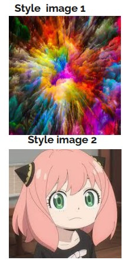
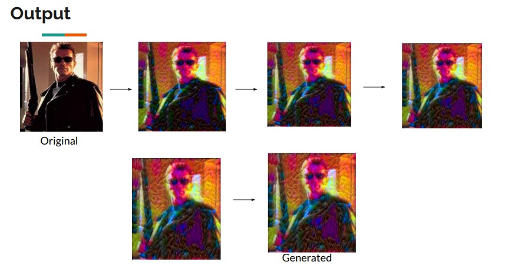
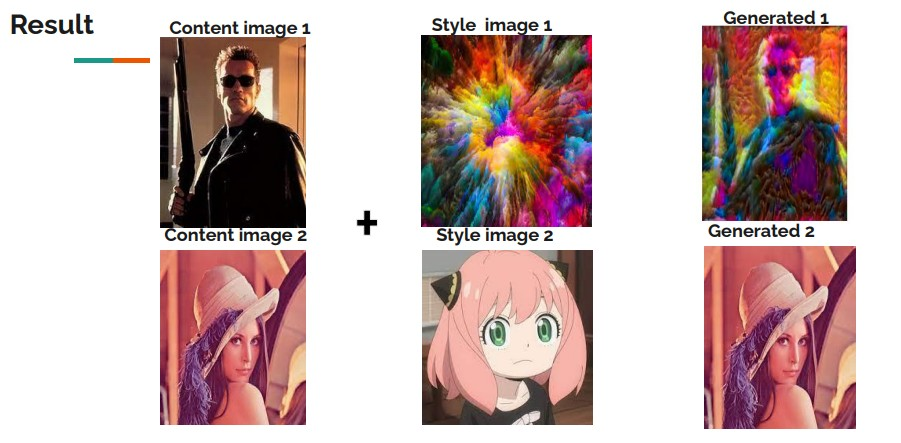
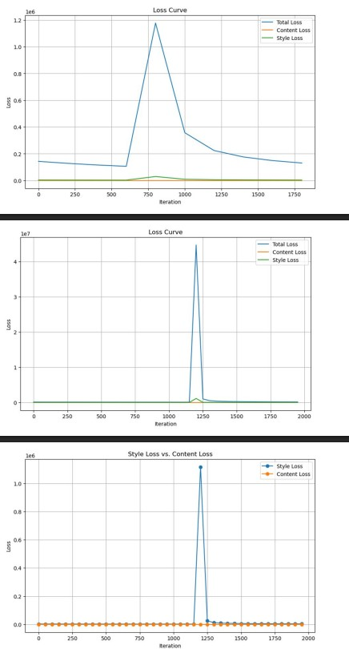

# Neural-Style-Transfer-Art-AI
Neural Style Transfer implementation using a pretrained VGG network to blend content and artistic style images through optimized content and style loss functions.
# Neural Style Transfer – Art & AI (2023)

## Overview
This project implements Neural Style Transfer (NST) to generate artistic images by combining the content of one image with the style of another using deep learning techniques.

## What I Implemented
- Designed a Neural Style Transfer (NST) system to combine content and artistic style images
- Implemented content loss and style loss
- Used a pretrained VGG network for feature extraction
- Optimized the model to balance content preservation and artistic style generation

## Tech Stack
- Python
- TensorFlow
- Pretrained VGG Network

## Implementation
The complete implementation is available in the Jupyter notebook:
- `NST.ipynb`

## Project Type
Academic / Learning Project

## Results

### 📌 Content Image

### 📌 Style Image

### 📌 Stylized Output

### 📌 Final Result

---

## Training Loss Curve
The plot below shows the convergence of total, content, and style loss during optimization.

---

## Presentation
A detailed presentation explaining the project architecture, loss functions, and results is available here:

 [**Neural Style Transfer – Project Presentation (PDF)**](./Neural%20Style%20Transfer%20art%20and%20AI.pdf)

